# 🐸 Meme Coin Volatility Index — Serverless MLOps Pipeline


**Live API Endpoint:** *[Lambda Function URL](https://g6r2etqn5hygjhv4lpohro46mu0ibzfd.lambda-url.eu-central-1.on.aws/)*  
**Dashboard:** *[Dashboard Link](https://pepe-index.streamlit.app)*

---

## 🚀 Problem Statement
Financial indicators like the traditional *Fear & Greed Index* operate on slow-moving data and miss the extreme volatility typical of memecoins such as **$PEPE**. These assets move on hype, sudden volume bursts, and social flows — not on fundamentals.

---

## 💡 Proposed Solution
This project implements a **serverless, event-driven MLOps pipeline** that produces a real-time volatility-momentum score tailored for memecoins. It automatically ingests market data, computes sentiment, stores historical values, and exposes results through a low-latency public API.

**Monthly Cost:** ~$0 (fits within AWS Free Tier)

---

## 🏗️ Architecture Overview

Infrastructure follows a **GitOps** workflow: AWS resources are managed via Terraform, and deployments run through GitHub Actions.

```mermaid
graph TD
    subgraph "External"
        User[👤 User / Dashboard]
        CG[🦎 CoinGecko API]
    end

    subgraph "AWS Cloud eu-central-1"
        EB[⏰ EventBridge] -->|Hourly Trigger| Lambda
        
        User -->|HTTPS Request| FURL[🌐 Lambda Function URL]
        FURL -->|Invoke| Lambda[λ Dockerized Python Lambda]
        
        Lambda -->|Fetch Market Data| CG
        Lambda -->|Compute Index| Lambda
        Lambda -->|Store Score| DDB[DynamoDB]
        
        Lambda -->|Return JSON| FURL
    end

    style Lambda fill:#ff9900,stroke:#232f3e,stroke-width:2px,color:white
    style DDB fill:#3b48cc,stroke:#232f3e,stroke-width:2px,color:white
    style EB fill:#ff4f8b,stroke:#232f3e,stroke-width:2px,color:white

```


⸻

## 🛠️ Tech Stack

| Component | Technology | Reason |
| :--- | :--- | :--- |
| **Compute** | AWS Lambda | Zero-maintenance, scales automatically |
| **Runtime** | Docker | Reproducible execution environment |
| **IaC** | Terraform | Declarative, version-controlled AWS setup |
| **Storage** | DynamoDB | Fast, serverless time-series persistence |
| **Scheduler** | EventBridge | Native cron automation |
| **CI/CD** | GitHub Actions | Automated build + deploy |


⸻

## 📸 Demo

### 1. Example API Output
```json
{
  "coin": "pepe",
  "index_score": 19,
  "sentiment": "Fear",
  "timestamp": "2025-11-22T16:54:11.607592"
}
```

## 2. Dashboard View


⸻

# 🧪 Local Development

Prerequisites
	•	Docker
	•	AWS CLI
	•	Terraform

1. Clone & Test the Docker Image

git clone https://github.com/znodanilo2017-byte/pepe-index.git
cd pepe-index

## Build
docker build -t meme-index .

## Run Lambda emulator
docker run -p 9000:8080 meme-index

2. Deploy Cloud Resources

terraform init
terraform apply


⸻

🧠 Lessons Learned
	•	Architecture compatibility issues on Mac M1 → solved using
docker buildx build --platform=linux/amd64 --provenance=false
	•	Reduced cold starts + API rate limits with lightweight runtime caching.
	•	Fully reproducible deployments via Terraform + GitHub Actions.

⸻

Built by Danylo Yuzefchyk — Serverless & MLOps Engineering

